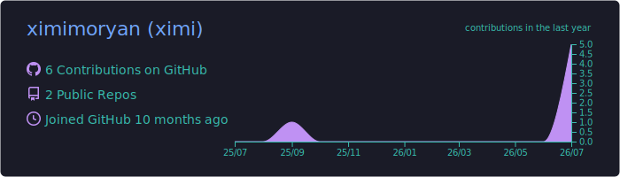
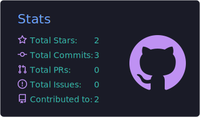
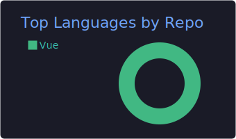

  <!-- Interactive custom fluid-gradient SVG Banner -->
  
    

  # Ximi | Full-Stack Developer & AI Systems Engineer

  **全栈工程师 · 金融科技 · 数据智能 · AI Engineering**

  [🇨🇳 中文](#zh-cn) · [🇺🇸 English](#english)
    

---

## 📊 GitHub Analytics

  <!-- Live GitHub Stats & Streaks with TokyoNight Theme -->
  
  
    

  <!-- Pre-generated summary cards with TokyoNight Theme -->
  
    
  
  

---

## 🇨🇳 中文介绍

<b>🚀 关于我 (About Me)</b>

 

你好，我是 **Ximi**，一名全栈开发者。

我喜欢把一个想法完整地变成可运行、可维护、可部署的产品。从前端交互、后端服务、数据模型和小程序，到容器化发布与线上运维，我关注系统各层之间的协作，也重视代码质量、安全边界和长期可维护性。

除了软件工程，我也持续从事金融科技、数据分析和风险管理相关实践，关注如何通过数据建模、风险特征和量化分析支持业务决策。

<b>🛠️ 技术栈与工程能力 (Tech Stack & Capabilities)</b>

 

### 💻 核心技术图谱

| 维度 | 熟练掌握的工具与框架 |
| :--- | :--- |
| **前端开发** | `Vue 3`、`TypeScript`、`JavaScript`、`Vite`、`Pinia`、`Vue Router`、组件化与响应式设计 |
| **后端开发** | `Java`、`Spring Boot`、`Spring MVC`、`MyBatis-Plus`、`Python`、`Node.js`、`RESTful API` |
| **小程序开发** | `微信小程序`、`uni-app`、多端适配、接口联调与发布 |
| **数据工程** | `MySQL`、`Redis`、数据建模、事务处理、缓存、并发控制与数据治理 |
| **数据分析** | `Python`、`Pandas`、`NumPy`、`Scikit-learn`、`Jupyter`、可视化分析与指标体系 |
| **金融风控** | 风险策略、特征工程、评分建模、规则引擎、贷前与贷后风险分析 |
| **AI 与接口** | `LLM 应用`、`OpenAI / Anthropic` 兼容 API、`SSE` (流式响应)、鉴权、限流与调用审计 |
| **工程交付** | `Maven`、`npm`、`Git`、`Shell`、`Docker`、`Linux`、`Nginx`、`Cloudflare`、自动化部署 |

### 🎯 关注的工程实践

- **接口与数据**：设计清晰的前后端接口契约（API Contract）与可演进的数据库结构。
- **业务落地**：构建高质量 Web 管理后台、小程序和完整的多端闭环业务流程。
- **服务端基建**：处理统一认证授权、API Key 托管、防刷限流、计量计费与调用审计。
- **缓存与并发**：结合 MySQL 和 Redis 制定高可用、强一致的缓存及并发竞争控制方案。
- **数据与决策**：从事金融数据分析、风险特征构建、风险规则策略以及评分卡风控模型建设。
- **分析与清洗**：熟练利用 Python/Pandas 进行大规模数据清洗、特征加工和探索性分析。
- **容器与部署**：使用 Docker 封装服务，编写自动化构建流水线与备份策略，保障服务高可用。
- **全链路诊断**：能够从前端网络请求、反向代理、路由分发，到后端进程与数据库锁，进行全栈全链路诊断与性能调优。

<b>📈 正在做的事 (Current Focuses)</b>

 

- 打造以 AI 和自动化为核心的个人 **OPC (One Person Company)** 技术体系与交付模式。
- 构建从产品构思、技术选型、开发交付，到自动化部署与免运维监控的端到端交付流。
- 探索大模型微调部署、智能工作流编排（LangChain/Flowise）、高性能中转 API 网关。
- 沉淀和打磨高复用性的开箱即用全栈模板、自动化交付组件。
- 持续对既有系统的架构、安全性、可观测性与用户体验进行打磨与迭代。

<a href="#top">返回顶部 ⬆️</a>

---

## 🇺🇸 English Profile

<b>🚀 About Me</b>

 

Hi, I'm **Ximi**, a full-stack developer.

I enjoy turning ideas into products that are usable, maintainable, and deployable. I work across web interfaces, backend services, data models, mini programs, containerized delivery, and production operations, with an emphasis on code quality, security boundaries, and long-term maintainability.

I also work with financial technology, data analytics, and risk management, applying data modeling, risk features, and quantitative analysis to support business decisions.

<b>🛠️ Tech Stack & Capabilities</b>

 

### 💻 Technology Map

| Domain | Technologies & Frameworks |
| :--- | :--- |
| **Frontend** | `Vue 3`, `TypeScript`, `JavaScript`, `Vite`, `Pinia`, `Vue Router`, component systems, and responsive design |
| **Backend** | `Java`, `Spring Boot`, `Spring MVC`, `MyBatis-Plus`, `Python`, `Node.js`, and `RESTful APIs` |
| **Mini Programs** | WeChat Mini Programs, `uni-app`, multi-platform adaptation, integration, and releases |
| **Data Engineering** | `MySQL`, `Redis`, data modeling, transaction management, caching, concurrency, and data governance |
| **Data Analytics** | `Python`, `Pandas`, `NumPy`, `Scikit-learn`, `Jupyter`, visual analytics, and metric systems |
| **Financial Risk** | Risk strategies, feature engineering, score modeling, rule engines, and lifecycle risk analysis |
| **AI & Integration** | LLM applications, `OpenAI / Anthropic` compatible APIs, `SSE` (streaming), authentication, rate limiting, and auditing |
| **Infrastructure** | `Maven`, `npm`, `Git`, `Shell`, `Docker`, `Linux`, `Nginx`, `Cloudflare`, and deployment automation |

### 🎯 Key Engineering Practices

- **Contracts & Models**: Designing clear frontend-backend contracts and robust, evolvable database schemas.
- **Product Delivery**: Building scalable web administration interfaces, mini-programs, and cross-platform business workflows.
- **Backend Services**: Implementing authentication, API key management, rate limiting, billing telemetry, and audit logs.
- **Cache & Concurrency**: Designing resilient caching, read-write splitting, and lock mechanisms using MySQL and Redis.
- **Risk Analytics**: Developing feature engineering frameworks, statistical scorecards, and rule engines for financial risk lifecycle.
- **Data Engineering**: Processing large datasets using Python/Pandas for cleaning, metric computation, and validation.
- **CI/CD & DevOps**: Automating containerized deployments, health auditing, backup, recovery, and rolling updates with Docker.
- **Troubleshooting**: Diagnosing cross-layer performance issues from DNS/Cloudflare down to database transactions.

<b>📈 What I'm Building</b>

 

- An AI-native **One-Person Company (OPC)** stack powered by extreme automation.
- End-to-end workflows spanning product design, rapid development, automated delivery, and operations.
- LLM gateway solutions, autonomous agent workflows, API routers, and AI-first web applications.
- A library of highly reusable full-stack engineering templates and deployment playbooks.
- Iterative improvements for system security, global observability, and superior user experience.

<a href="#top">Back to top ⬆️</a>

